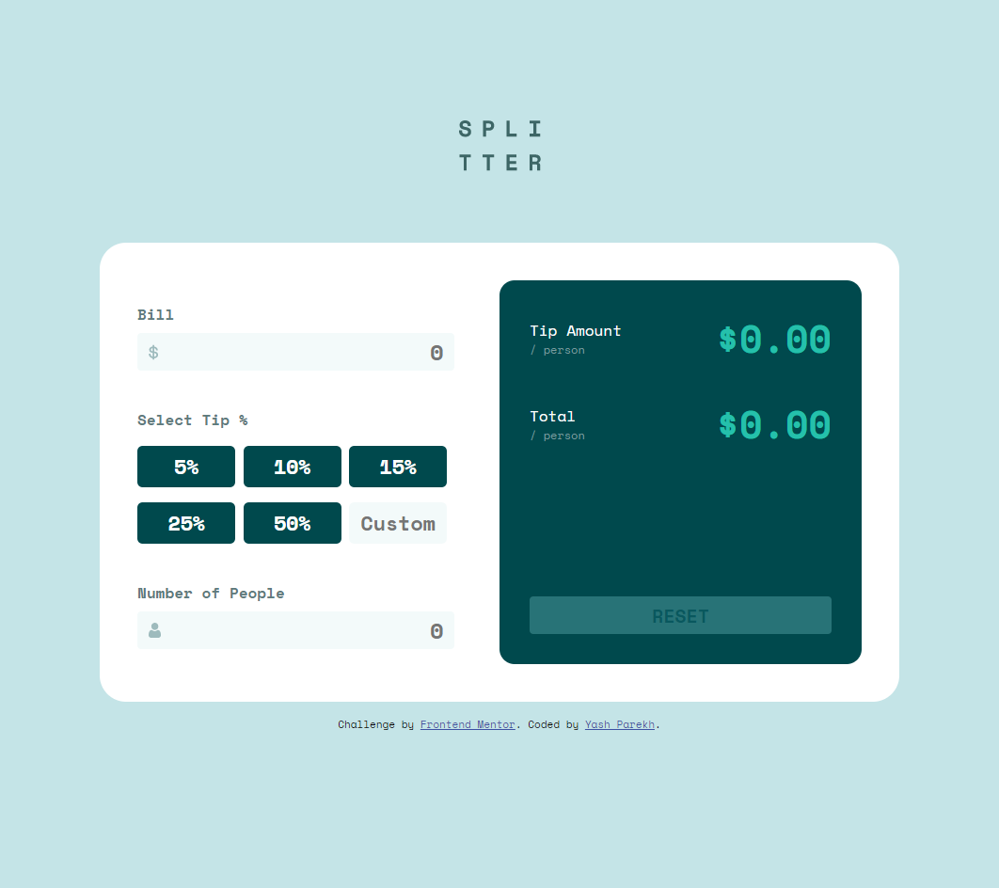
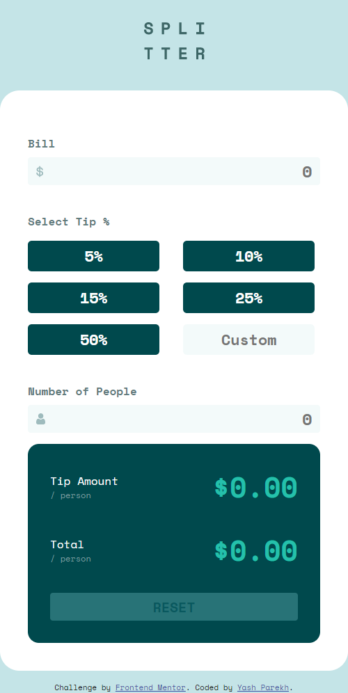

# Frontend Mentor - Tip calculator app solution - Yash Parekh

This is a solution to the [Tip calculator app challenge on Frontend Mentor](https://www.frontendmentor.io/challenges/tip-calculator-app-ugJNGbJUX). Frontend Mentor challenges help you improve your coding skills by building realistic projects.

## Table of contents

- [Overview](#overview)
  - [The challenge](#the-challenge)
  - [Video](#video)
  - [Screenshot](#screenshot)
  - [Links](#links)
- [My process](#my-process)
  - [Built with](#built-with)
  - [What I learned](#what-i-learned)
  - [Continued development](#continued-development)
  - [Useful resources](#useful-resources)
- [Author](#author)
- [Acknowledgments](#acknowledgments)

## Overview

### The challenge

Users should be able to:

- View the optimal layout for the app depending on their device's screen size
- See hover states for all interactive elements on the page
- Calculate the correct tip and total cost of the bill per person

### Video

https://user-images.githubusercontent.com/7217164/126884724-44ba886f-1a79-4f01-9e95-2efaff999ac0.mp4

### Screenshot

<p align="center">
  
  
</p>

### Links

- Solution URL: <https://github.com/yash20010/tip-calculator#the-challenge>
- Live Site URL: <https://yash20010.github.io/tip-calculator/>

## My process

### Built with

- Semantic HTML5 markup
- CSS custom properties
- Flexbox
- Vanilla JavaScript

### What I learned

Learnt about CSS outline property for input HTML elements

```
.people input:focus {
  outline: none;
  border: 2px solid var(--strong-cyan);
}
```

### Continued development

- Clean javascript to reduce redundant code
- Update it to OOP style form functional style

### Useful resources

- [MDN](https://developer.mozilla.org/en-US/) - This helped me with HTML, CSS and Javascript.
- [Favicon.io](https://favicon.io/) - This helped me create favicon quickly, for multiple devices and for free.
- [Stack Overflow](https://stackoverflow.com/) - This helped me lookup a lot of tiny things with one google search.

## Author

- Website - [Yash Parekh](https://yashparekh.netlify.app/)
- Frontend Mentor - [@yash20010](https://www.frontendmentor.io/profile/yash20010)
- Twitter - [@yash20010](https://www.twitter.com/yash20010)

## Acknowledgments

- My wife and my daughter (for all their support)
- Leon Noel (who taught me everything about full stack web development)
